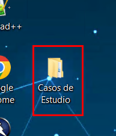
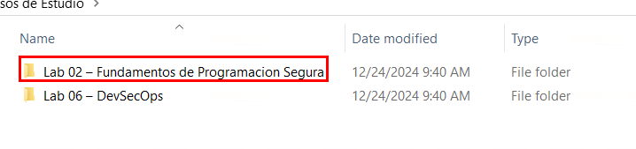
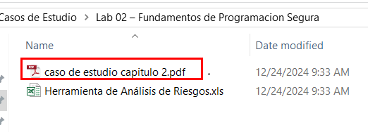
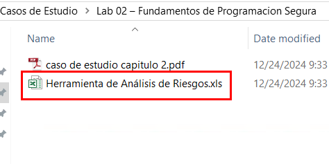
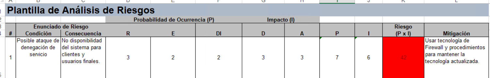

# Caso de estudio: Aplicación de metodología DREAD a un caso real 

## Objetivo de la práctica:

Al finalizar la práctica, serás capaz de:

- Aplicar un modelado de amenazas al utilizar la metodología DREAD a un caso de estudio real.

## Duración aproximada:

- 25 minutos.

## Instrucciones:

### Tarea 1. Análisis del caso.

Paso 1. Abre la carpeta llamada `Casos de Estudio` ubicada en el escritorio.

Paso 2. Ingresa a la carpeta `Lab 02 – Fundamentos de Programacion Segura`.

Paso 3. Abre el archivo del caso de estudio llamado `caso de estudio capitulo 2.pdf`. Leelo y analizar su arquitectura, componentes, códigos y resultados.

### Tarea 2. Aplicación de metodología DREAD.

Paso 4. Abre el archivo `Herramienta de Análisis de Riesgos.xls` y, con base en el análisis realizado anteriormente, completa la hoja de cálculo usando la metodología DREAD.

### Resultado esperado:

---

#### Para regresar al índice general, da clic [aquí](./README.md).
