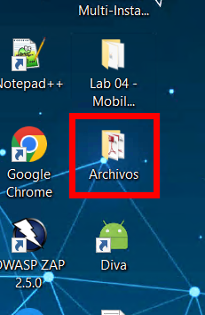
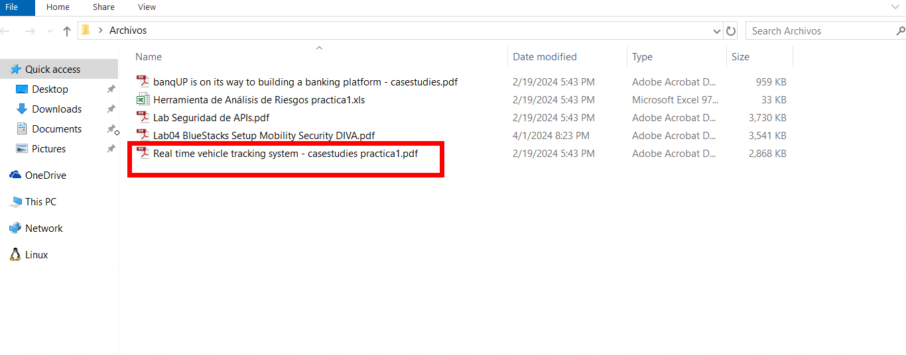
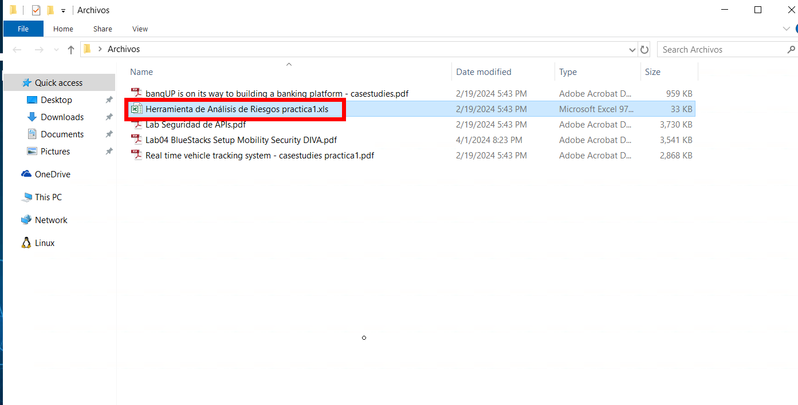

# Caso de estudio: Aplicacion de metodologia DREAD a un caso real 

## Objetivo de la práctica:

Al finalizar la práctica, serás capaz de aplicar un modelado de amenazas usando la metodologia DREAD a un caso de estudio real.

## Duración aproximada:

- 25 minutos.

## Instrucciones 

### Tarea 1. Analisis del caso

Paso 1. Abrir la carpeta de archivos ubicada en el escritorio.

Paso 2. Acceder al archivo del caso de estudio llamado `Real time vehicle tracking system - casestudies practica1.pdf` y analizarlo.

### Tarea 2. Aplicacion de metodologia DREAD

Paso 3. Abrir el archivo `Herramienta de Análisis de Riesgos practica1.xls` y completar la hoja de calculo usando la metodologia DREAD.

### Resultado esperado

