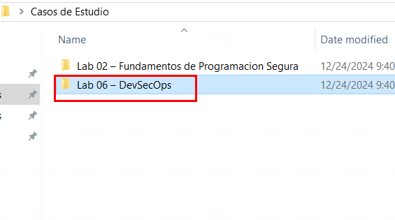
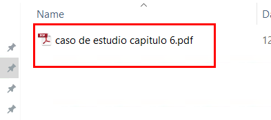

# Caso de estudio: DevSecOps aplicado a un caso real 

## Objetivo de la práctica:

Al finalizar la práctica, serás capaz de recomendar mejoras de seguridad de DevSecOps un caso de estudio real.

## Duración aproximada:
- 25 minutos.

## Instrucciones 

### Tarea 1. Analisis del caso 

Paso 1. Abrir la carpeta llamada `Casos de Estudio` ubicada en el escritorio.

Paso 2. Ingresar a la carpeta `Lab 06 – DevSecOps`

Paso 3. Acceder al archivo del caso de estudio llamado `caso de estudio capitulo 6.pdf`, leerlo y analizarlo.

Paso 4. Participar realizando recomendaciones para implementar seguridad basada en los principios de DevSecOps en el caso de estudio.
