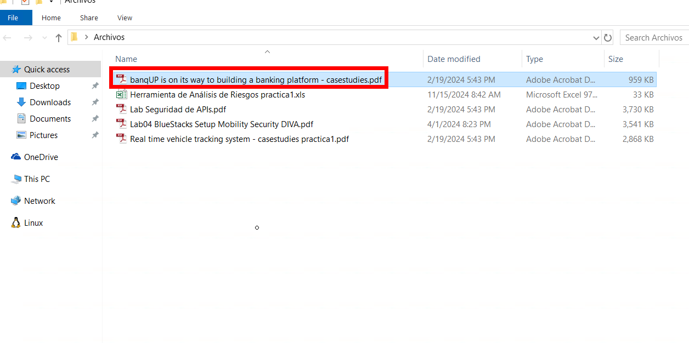

# Caso de estudio: DevSecOps aplicado a un caso real 

## Objetivo de la práctica:

Al finalizar la práctica, serás capaz de proporcionar las mejoras de seguridad de DevSecOps un caso de estudio real.

## Duración aproximada:
- 25 minutos.

## Instrucciones 

### Tarea 1. Analisis del caso 

Paso 1. Abrir la carpeta de archivos ubicada en el escritorio.

Paso 2. Acceder al archivo del caso de estudio llamado `banqUP is on its way to building a banking platform - casestudies.pdf` y analizarlo.

Paso 3. Participar realizando recomendaciones para implementar DevSecOps en el caso de estudio.

