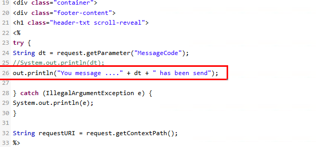

# Preventing Applications from Cross-site scripting (XSS) Attack

## Objetivo de la práctica:

Identificar y prevenir vulnerabilidades de Cross-Site Scripting (XSS) mediante la implementación de técnicas de codificación de salida, asegurando que los datos renderizados no permitan la ejecución de scripts maliciosos en la aplicación.

## Duración aproximada:
- 5 minutos.

## Instrucciones 

Paso 1. Haz clic en `Contact` en el menú.

Paso 2. Para probar si la aplicación es vulnerable a ataques XSS, ingresa el siguiente código JavaScript en el cuadro de texto Message y haz clic en el botón `Send`:

    

Resultado: 
- El JavaScript se ejecutará y se mostrará un mensaje emergente (pop-up). Esto indica que la aplicación es vulnerable a ataques XSS.
- La vulnerabilidad existe porque la aplicación no ha implementado una técnica de codificación de salida (output encoding) al renderizar los datos.

**Confirmación de la vulnerabilidad a XSS:**

Ve a la pestaña `FetchMatching.jsp`, línea n.º 26.
Verás que no se realiza ninguna codificación de salida antes de renderizar los datos.

Paso 3. Haz clic en el botón OK del mensaje emergente mostrado.

Paso 4. Para prevenir ataques XSS, ve a la pestaña `FetchMatching.jsp`, línea n.º 26, y reemplaza la línea de código con el siguiente fragmento:

    out.println("Your message ....\"" + ESAPI.encoder().encodeForHTML(dt) + "\" has been sent");

Paso 5. Haz clic en el botón `Save` en la parte superior del editor para guardar los cambios.

Paso 6. Intenta ejecutar el ataque XSS nuevamente siguiendo los pasos 1 y 2.

Resultado:
- Esta vez, el JavaScript no se ejecutará. Esto se debe a que la aplicación utiliza codificación de salida antes de renderizar los datos.

- La codificación de salida evita que la aplicación sea vulnerable a ataques XSS.

Paso 7. Haz clic en el botón `Reset` para restaurar el laboratorio al estado anterior y haz clic en `OK` en el mensaje emergente que indica `¡Restablecimiento exitoso!`.
