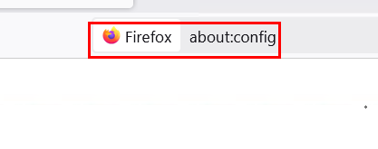
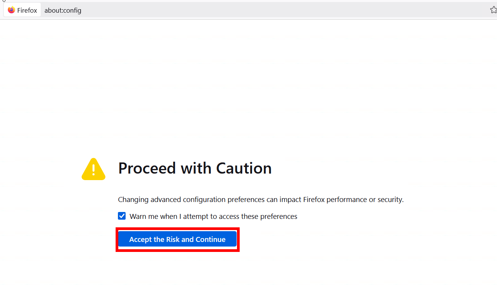
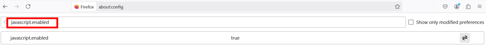
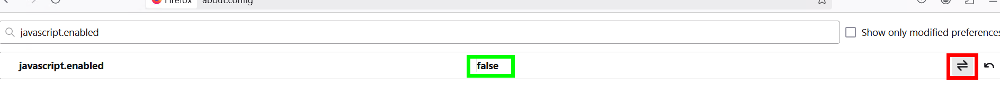
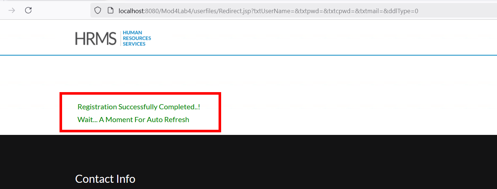
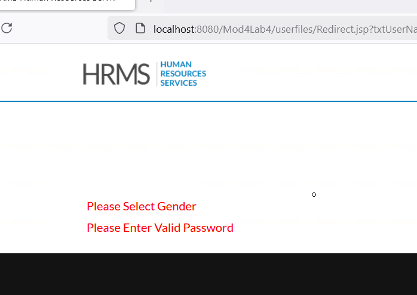

# Examining the Importance of Server-side Input Validation

## Objetivo de la práctica:

Identificar y mitigar la vulnerabilidad de **path traversal** en la funcionalidad de descarga de archivos, asegurando que solo los archivos legítimos y predefinidos sean accesibles mediante restricciones apropiadas en el código del servidor.

## Duración aproximada:
- 5 minutos.

## Instrucciones 

**Paso 1.**

 Haz clic en el menú **Register**.

**Paso 2:**

 Se abrirá un formulario de registro en una nueva pestaña. Haz clic en el botón **Register** sin ingresar ningún dato.

Resultado: 
- Aparecerá un mensaje solicitando completar todos los campos. Cierra la pestaña recién abierta.
- El formulario implementa validación del lado del cliente mediante JavaScript. Esta validación se realiza en el navegador antes de que los datos sean enviados al servidor.

**Confirmación de validación del lado del cliente:**

- Ve a la pestaña register.jsp, línea n.º 12.
Nota: La validación del lado del cliente puede ser fácilmente eludida deshabilitando JavaScript en el navegador.

**Paso 3:**

Copia el enlace del formulario y pégalo en Firefox

**Paso 4:**

Deshabilita JavaScript en el navegador para comprobar cómo un atacante podría eludir la validación del lado del cliente abriendo una nueva pestaña y colocando `about:config` en la barra direcciones. 



Dar clic en `Accept the Risk and Continue`.



En la barra de búsqueda, colocar `javascript.enabled`.



Dar clic en el boton de alternan (encerrado en cuadrado rojo) para que el valor cambie a `false`.



**Paso 5:**

Con JavaScript deshabilitado y sin colocar ningún dato adicional, haz clic en el botón Register.

  
- **Resultado:** Aparecerá el mensaje **"Registration Successfully Completed..!"**. Este mensaje indica que la validación del lado del cliente puede ser eludida al deshabilitar JavaScript.  



**Conclusión:**  
La validación de entrada debe realizarse siempre del lado del servidor, ya que las validaciones del lado del servidor son más confiables que las del lado del cliente.  

**Paso 6:**  
  
Para implementar la validación del lado del servidor en el formulario de registro, ve a la pestaña **Redirect.jsp** e inserta la siguiente función de validación en la línea n.º **66**:  

```java
Pattern p = Pattern.compile("^[a-zA-Z]*$");
Pattern p1 = Pattern.compile("^([_a-zA-Z0-9-]+(\\.[_a-zA-Z0-9-]+)*@[a-zA-Z0-9-]+(\\.[a-zA-Z0-9-]+)*(\\.[a-zA-Z]{1,6}))?$");
Pattern PASSWORD_PATTERN = Pattern.compile("((?=.*\\d)(?=.*[a-z])(?=.*[A-Z])(?=.*[@#$%]).{6,20})");

Matcher m = p.matcher(Name);
Matcher m1 = p1.matcher(email);
Matcher m2 = PASSWORD_PATTERN.matcher(pass);

if (Name.equals("null") || !m.matches()) {
    msg = msg + "<br/>" + "Please Enter Valid Name";
    val = 0;
}
if (email.equals(null) || !m1.matches()) {
    msg = msg + "<br/>" + "Please Enter Valid Email Address";
    val = 0;
}
if (gender.equals(null) || gender.equals("0")) {
    msg = msg + "<br/>" + "Please Select Gender";
}
if (pass.equals(null) || !m2.matches()) {
    msg = msg + "<br/>" + "Please Enter Valid Password";
    val = 0;
}
if (confirmpass.equals(null) || !confirmpass.equals(pass)) {
    msg = msg + "<br/>" + "Confirm Password doesn't match";
    val = 0;
}
```

**Paso 7:** 

Haz clic en el botón **Save** en la parte superior del editor para guardar los cambios.  

**Paso 9:**  

Haz clic en **Register**, y pega este nuevo formulario en Firefox con JavaScript deshabilitado como se indicó en el paso 3.  

- **Resultado:** Esta vez, la página implementará validación del lado del servidor y mostrará un mensaje apropiado. Esto demuestra que la validación del lado del servidor es más confiable que la del lado del cliente.  



**Paso 10:**  
Vuelve a habilitar JavaScript antes de pasar al siguiente laboratorio.  

**Paso 11:**  
Haz clic en el botón **Reset** para restaurar el laboratorio al estado anterior y haz clic en **OK** en el mensaje emergente que indica **"¡Restablecimiento exitoso!"**.  

**Paso 12:**  
Haz clic en el botón **HOME** para volver a la página principal.  
