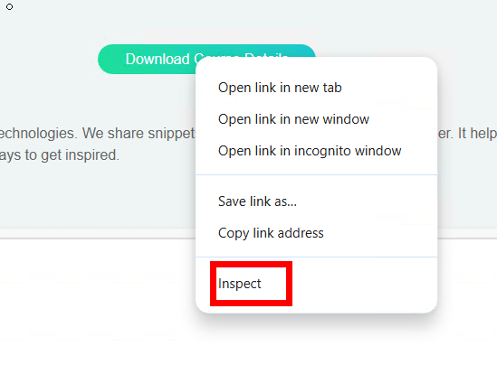
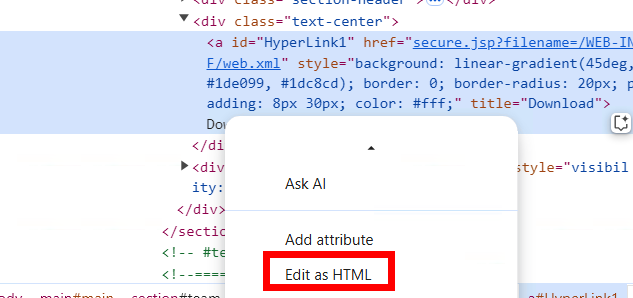
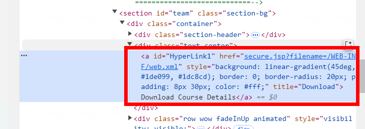
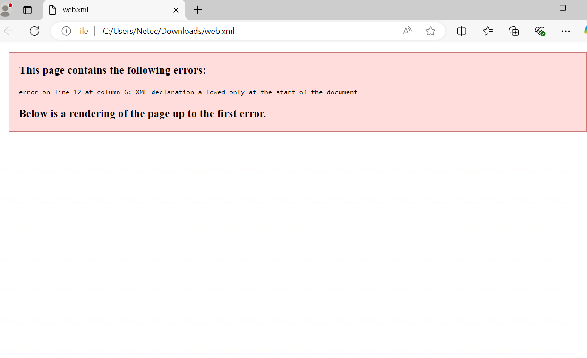
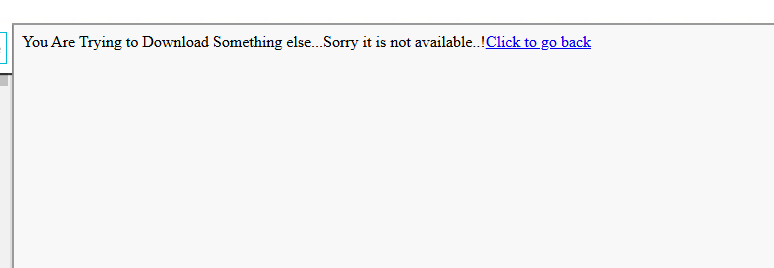

# Protecting Applications from Path Travesal Attack

## Objetivo de la práctica:
Al finalizar la práctica, serás capaz de:
- Objetivo1
- Objetivo2
- Objetivo3

## Duración aproximada:
- 5 minutos.

## Instrucciones 

**Paso 1:**  

Haz clic en el menú **ABOUT**.  

**Paso 2:**  
Haz clic en el enlace **Download Course Details**. Se descargará el archivo **CourseDetails.pdf**.  

**Paso 3:**  
Haz clic derecho en el enlace **Download Course Details** y selecciona **Inspect** como se muestra en la figura. Aparecerá la ventana de herramientas para desarrolladores.  



**Paso 4:**  
Haz clic derecho en la etiqueta de anclaje `<a>` con el id **Hyperlink1** y selecciona **Edit as HTML** como se muestra en la figura.  



**Paso 5:**  
Reemplaza el atributo `href` de la etiqueta `<a>` con el siguiente valor. Luego, cierra la ventana de herramientas para desarrolladores:  
```html
href="secure.jsp?filename=/WEB-INF/web.xml"
```  


**Paso 6:**  
Haz clic nuevamente en el enlace **Download Course Details**.  
- **Resultado:** Podrás descargar el archivo **web.xml**.  
  - Los archivos almacenados en subdirectorios son vulnerables a ataques de **path traversal**.  
  - Un atacante podría adivinar la URL y acceder a cualquier archivo crítico del directorio web.  



**Confirmación de la vulnerabilidad de path traversal:**  
Ve a la pestaña **secure.jsp**, línea n.º **20**. Allí verás que el nombre del archivo (**filename**) se usa directamente para crear la variable de ruta (**PathVariable**).  
Este enfoque podría ser vulnerable a ataques de path traversal, ya que cualquier persona que intente descargar un archivo sensible puede adivinar y modificar el nombre del archivo.  

- **Recomendación:** La ruta de la carpeta del archivo debe concatenarse con el nombre del archivo para restringir el acceso no autorizado a subdirectorios.  

**Paso 7:**  
Para concatenar la ruta de la carpeta con el nombre del archivo, ve a la pestaña **secure.jsp** e inserta el siguiente código en la línea n.º **19**:  
```java
locationVariable = locationVariable + "/webdoc/";
```  

**Paso 8:**  
Ve a la pestaña **index.jsp** y edita el atributo `href` del enlace con el id **HyperLink1** en la línea n.º **381**:  
```html
href="secure.jsp?filename=CourseDetails.pdf"
```  

**Paso 9:**  
Haz clic en el botón **Save** en la parte superior del editor para guardar los cambios.  

**Paso 10:**  
Ahora, intenta nuevamente descargar el archivo **web.xml**, siguiendo los pasos 1 a 6.  
- **Resultado:** Esta vez no podrás descargar el archivo **web.xml**. En su lugar, aparecerá un mensaje:  
**"You Are Trying to Download Something else...Sorry it is not available..! Click to go back"**  



**Paso 11:**  
Haz clic en el botón **Reset** para restaurar el laboratorio al estado anterior y selecciona **OK** en el mensaje emergente que indica **"Reset Successful!"**.  

**Paso 12:**  
Haz clic en el botón **HOME** para volver a la página principal.  
