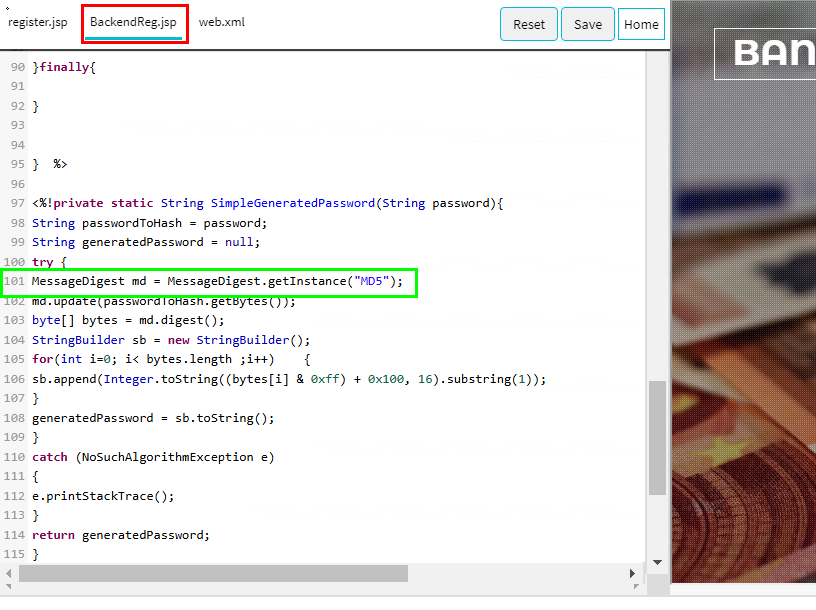
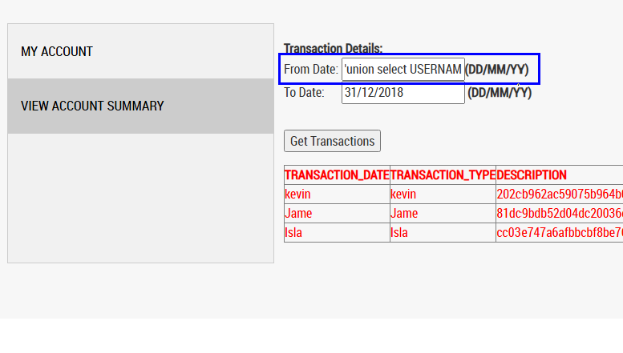
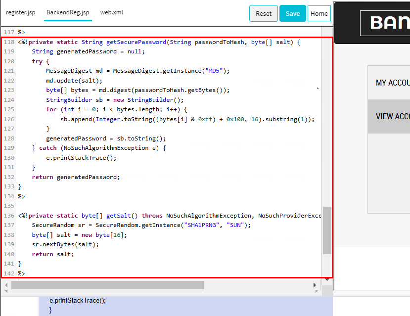
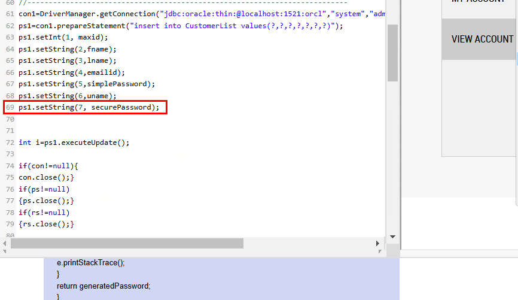
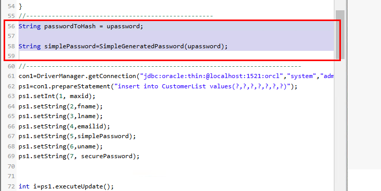

# Mitigating Insecure Cryptographic Storage Vulnerability with Strong Hashing Technique

## Objetivo de la práctica:

Identificar las vulnerabilidades del algoritmo de hashing MD5 en el almacenamiento de contraseñas, demostrar la facilidad con la que los hashes pueden ser comprometidos mediante ataques de inyección SQL, e implementar salting para mejorar la seguridad criptográfica de las contraseñas, reduciendo su previsibilidad y resistencia frente a ataques de cracking.

## Duración aproximada:

- 10 minutos.

## Instrucciones 

Paso 1. Haz clic en el menú `REGISTER` para registrarte como un nuevo usuario.

Paso 2. Rellena el formulario de registro y haz clic en el botón `SUBMIT`.

- Resultado: Aparecerá un mensaje emergente de "Registro exitoso". Haz clic en el botón OK del mensaje emergente. Se registrará un nuevo usuario.
- Para proteger la contraseña de usuarios no autorizados, esta se cifra antes de guardarse en la base de datos.

**Confirmación del cifrado de contraseñas:**

- Ve a la pestaña BackendReg.jsp, línea n.º 101.

- Verás que la aplicación implementa el algoritmo de hashing MD5 para generar un hash de la contraseña.

Paso 3. Para comprobar la seguridad del hash de la contraseña, haz clic en el menú `LOGIN` e inicia sesión con las siguientes credenciales:

    Nombre de usuario: tester1
    Contraseña: test

Paso 4. Intenta acceder a los detalles del cliente mediante una inyección SQL. Introduce la siguiente cadena de inyección SQL en el campo `From Date`:
    
    'union select USERNAME,FNAME+LNAME,PASSWORD, 1 from CUSTOMERLIST order by DESCRIPTION --
    

Paso 5. Haz clic en el botón `Get Transactions`.

- Resultado: Verás la lista de clientes registrados junto con sus contraseñas cifradas.
- El algoritmo MD5 genera hashes débiles que pueden descifrarse fácilmente con herramientas de cracking de hash. 

Además:

- Es vulnerable a ataques de diccionario y fuerza bruta.
- Produce el mismo hash para múltiples valores de entrada.

**Prevención de vulnerabilidades en el almacenamiento criptográfico con MD5:**

Para proteger los datos, implementa salting. Salting consiste en agregar un dato aleatorio a la contraseña antes de aplicar el hashing, lo que genera un resultado menos predecible y más difícil de descifrar.

Paso 6:
Para implementar salting, ve a la pestaña `BackendReg.jsp` y crea la siguiente función getSecurePassword() en la línea n.º 118:

    <%!private static String getSecurePassword(String passwordToHash, byte[] salt) {
        String generatedPassword = null;
        try {
            MessageDigest md = MessageDigest.getInstance("MD5");
            md.update(salt);
            byte[] bytes = md.digest(passwordToHash.getBytes());
            StringBuilder sb = new StringBuilder();
            for (int i = 0; i < bytes.length; i++) {
                sb.append(Integer.toString((bytes[i] & 0xff) + 0x100, 16).substring(1));
            }
            generatedPassword = sb.toString();
        } catch (NoSuchAlgorithmException e) {
            e.printStackTrace();
        }
        return generatedPassword;
    }
    %> 

    <%!private static byte[] getSalt() throws NoSuchAlgorithmException, NoSuchProviderException {
        SecureRandom sr = SecureRandom.getInstance("SHA1PRNG", "SUN");
        byte[] salt = new byte[16];
        sr.nextBytes(salt);
        return salt;
    }
    %>

Paso 7. Reemplaza la línea n.º 69 con el siguiente código:

    ps1.setString(7, securePassword);

Paso 8. Reemplaza las líneas n.º 56 a 59 con el siguiente código:

    String passwordToHash = upassword;
    byte[] salt = getSalt();
    String simplePassword = SimpleGeneratedPassword(upassword);
    String securePassword = getSecurePassword(upassword, salt);

Paso 9. Haz clic en el botón `Save` en la parte superior del editor para guardar los cambios.

Paso 10. Repite los pasos 1 y 2 para crear un nuevo usuario.

- Resultado: Esta vez la contraseña se cifra después de agregar un salt aleatorio.

Paso 11. Repite los pasos 3 al 6. Realiza la inyección SQL introduciendo la siguiente cadena de inyección SQL en el campo `From Date`:

    'union select USERNAME,PASSWORD,SALTPASSWORD, 1 from CUSTOMERLIST order by DESCRIPTION --

- Resultado: Encontrarás que la contraseña está cifrada después de agregar un salt aleatorio. Esto genera contraseñas menos predecibles que no pueden descifrarse fácilmente con herramientas de cracking de hash.
- Esto demuestra que agregar sal a las contraseñas cifradas con MD5 crea contraseñas más seguras.

Paso 12. Haz clic en el botón `Reset` para restaurar el laboratorio al estado anterior y haz clic en `OK` en el mensaje emergente que indica `¡Restablecimiento exitoso!`.
