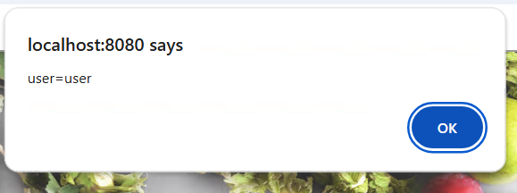
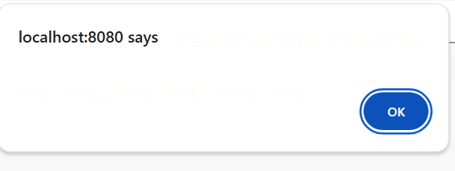

# Preventing  Session Cookies from Client-Side Scripts Attacks

## Objetivo de la práctica:

Prevenir un ataque de **XSS basado en DOM** mediante la configuración de cookies con la opción **HttpOnly** activada, asegurando que los scripts del lado del cliente no puedan acceder a las cookies de sesión, lo que protege contra el **secuestro de sesión (session hijacking)**.

## Duración aproximada:

- 10 minutos.

## Instrucciones 

### **Paso 1:**  
Inicia sesión utilizando las siguientes credenciales:  
- **Usuario:** user  
- **Contraseña:** pass  

---

### **Paso 2:**  
Haz clic en el menú **CONTACT**.  

---

### **Paso 3:**  
Ingresa lo siguiente en el cuadro de texto **Message** y haz clic en el botón **Send**:  
```html
<script>alert(document.cookie);</script>
```  
- **Resultado:** Aparecerá un mensaje emergente mostrando las cookies. Esto demuestra que las cookies pueden ser robadas utilizando un ataque de **XSS basado en DOM**.  
- Las cookies robadas podrían usarse para realizar un **ataque de secuestro de sesión (session hijacking)**.  



- **Razón de la vulnerabilidad:**  
   - Las cookies son accesibles mediante scripts del lado del cliente.  
   - Para confirmar que las cookies son accesibles por código del lado del cliente, ve a la pestaña **CheckLogin.jsp**, línea n.º **17**. Allí verás que la propiedad **httpOnlyCookies** de las cookies está configurada como **false**, lo que permite que los scripts del lado del cliente accedan a las cookies.  

---

### **Paso 4:**  
Haz clic en **OK** en la ventana emergente.  

---

### **Paso 5:**  
Para evitar que los scripts del lado del cliente accedan a las cookies de sesión:  
1. Ve a la pestaña **CheckLogin.jsp**.  
2. Reemplaza el código en la línea n.º **17** con el siguiente:  
```java
loginCookie.setHttpOnly(true);
```  

---

### **Paso 6:**  
Haz clic en el botón **Save** en la parte superior del editor para guardar los cambios y selecciona **OK** en la alerta.  

---

### **Paso 7:**  
Repite los pasos del **1 al 3** e intenta nuevamente acceder a las cookies del documento.  
- **Resultado:** Esta vez no podrás ver las cookies creadas en la ventana emergente, ya que las cookies creadas ya no son accesibles mediante scripts del lado del cliente.  



Esto demuestra que puedes restringir el acceso a las cookies de la aplicación desde scripts del lado del cliente.  

---

### **Paso 8:**  
Haz clic en el botón **Reset** para restaurar el laboratorio al estado anterior y selecciona **OK** en el mensaje emergente que indica:  
**"Reset Successful!"**  

---

### **Paso 9:**  
Haz clic en el botón **HOME** para volver a la página principal.  
